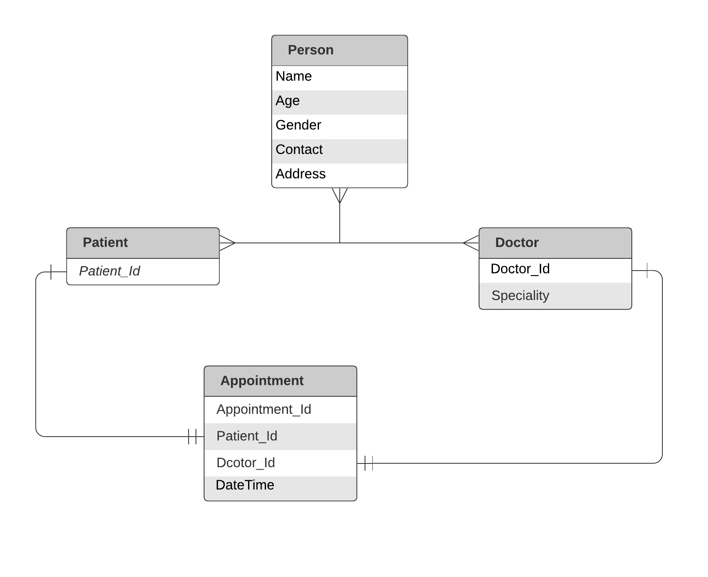
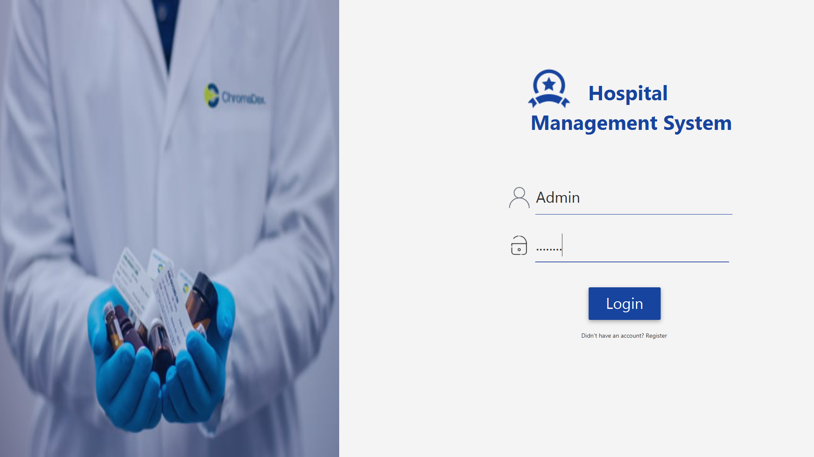
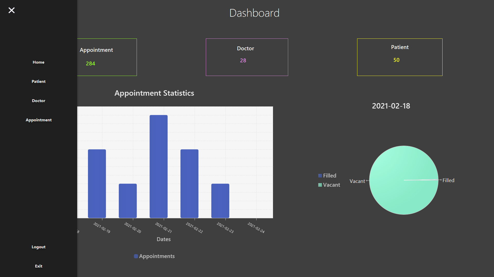
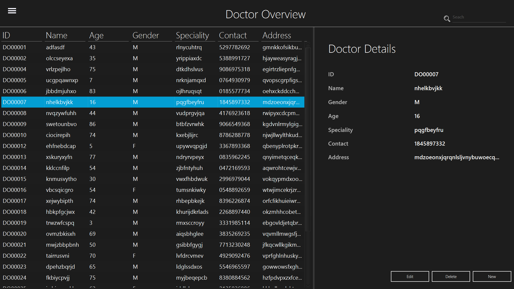
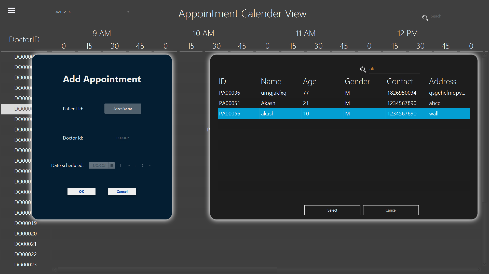

# Hospital Management System
The project ```Hospital Management System (HMS)``` is for
computerizing the working in a hospital. The software takes
care of all the requirements of an average hospital and is
capable to provide easy and effective storage of information
related to patients that come up to the hospital. 

1. Maintaining patient’s and doctor’s entry records.
2. Tracking and statistics of Appointment records.
3. User or Administrator can search a any record by id, name or other details. 
---
## Scope

Easily scalable and extensible. It can be used in any Hospital, Clinic, Dispensary or Pathology
labs for maintaining patient details and their test results. 

---
## ER Diagram

---
## Screenshot






